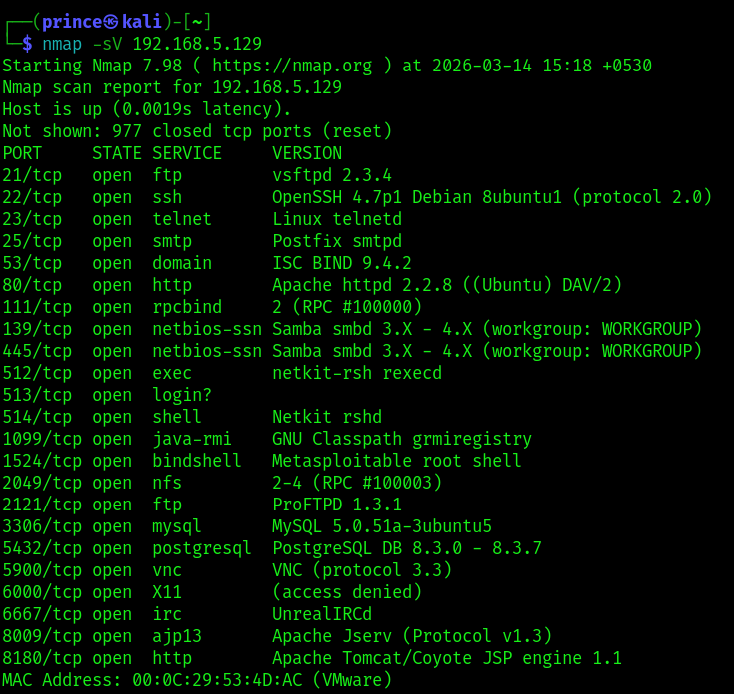

# Metasploitable2 Penetration Testing Lab

This repository documents a penetration testing lab performed against the intentionally vulnerable **Metasploitable2** virtual machine using **Kali Linux**.
The objective of this lab was to simulate a basic internal penetration test workflow including enumeration, vulnerability identification, exploitation, and proof-of-concept validation.

---

## Lab Environment

| Component             | Description       |
| --------------------- | ----------------- |
| Attacker Machine      | Kali Linux        |
| Target Machine        | Metasploitable2   |
| Network Configuration | Host-Only Network |
| Virtualization        | VMware            |

---

## Tools Used

* Nmap
* Metasploit Framework
* DVWA (Damn Vulnerable Web Application)

---

## Methodology

The penetration testing process followed a structured workflow:

1. Lab setup and network configuration
2. Network connectivity verification
3. Service enumeration using Nmap
4. Vulnerability identification
5. Exploitation using Metasploit Framework
6. Web application vulnerability testing (DVWA)

---

## Vulnerabilities Exploited

* **vsftpd 2.3.4 Backdoor** – Remote command execution via Metasploit
* **Samba Username Map Script** – Remote root access
* **SQL Injection (DVWA)** – Database information disclosure

---

## Repository Structure

```
metasploitable2-penetration-testing-lab
│
├── screenshots
│   └── penetration testing screenshots
│
├── report
│   └── metasploitable2_pentest_report.pdf
│
└── README.md
```

---

## Sample Enumeration Result

Example of service enumeration performed using Nmap.



---

## Disclaimer

This project was conducted in a **controlled lab environment** for **educational and learning purposes only**.
Do not attempt to exploit systems without proper authorization.


